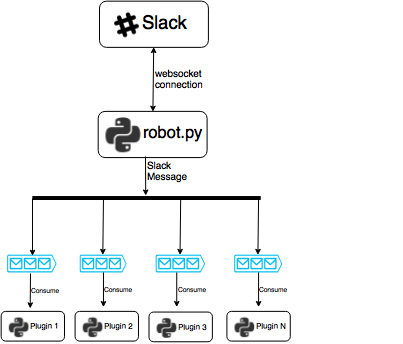

Architecture
============

At its core, Charlesbot essentially works as follows:

When a message comes in through a Slack websocket, ``robot.py`` delivers a copy
of the message to each Charlesbot plugin. This is done by pushing this message
onto each plugin's queue, at which point the plugin is free to consume the
message in its own schedule.

This approach decouples the processing of a message from the receiving of a
message, which helps in a scenario where a channel is flooded with more
incoming messages than a plugin is able to handle (in a timely manner).

Abstract Base Class
-------------------

This may seem like a lot of boilerplate for each plugin to deal with, but
thankfully this is taken care of by the ``BasePlugin`` abstract base class.

A plugin author will need to inherit from ``BasePlugin`` and implement the
plugin logic using at minimum the following two abstract methods:

.. code-block:: python

    def get_help_message(self):
        pass

    def process_message(self, message):
        pass
