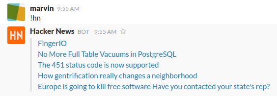

Charlesbot Plugin Tutorial
==========================

This tutorial will cover the basics of how to build a Charlesbot plugin. You do
not need to know a whole lot about Python or Slack to follow along, but it
might help if you do.

It's been structured to make it easy for folks to follow along so if you see
any room for improvement, I would love to `hear from you`__.

__ https://github.com/marvinpinto/charlesbot/issues

The full package for this ``hello-world`` plugin is available at
`marvinpinto/charlesbot-hello-world`__. For folks following along, each step
here links to a corresponding commit in that repository which should hopefully
make things easier.

__ https://github.com/marvinpinto/charlesbot-hello-world

Goals
-----

Let's start with some high level goals. Our ficticious plugin should be able to
do the following:

- List the top 5 stories currently trending on Hacker News (``!hn``)

- Periodically print out the top 5 newly submitted Hacker News stories

The purpose of this is to demonstrate the mechanism Charlesbot uses to respond
to human-initated events, run periodic jobs, and read program configuration.
The building blocks of a chatbot if you will!

Supplies
--------

Here's the basics you'll need to get started:

- Python 3.4.3
- pyvenv__
- `Slack Bot Token`__
- `git`__
- `cookiecutter`__ (``pip install cookiecutter``)

__ https://docs.python.org/3.4/library/venv.html
__ https://my.slack.com/services/new/bot
__ https://git-scm.com
__ https://github.com/audreyr/cookiecutter

.. note::

    You have the option of using the pre-built `vagrant`__ environment too, if
    you wish. The ``Vagrantfile`` is available in the
    `charlesbot-hello-world`__ repository.

__ https://www.vagrantup.com/
__ https://github.com/marvinpinto/charlesbot-hello-world/blob/master/Vagrantfile

Get our Toes Wet
----------------

Thanks to the wonderful work done in the `cookiecutter`__ project, starting a
new Charlesbot plugin is as simple as using the `cookiecutter template`__
already setup! Here's how to use it:

__ https://github.com/audreyr/cookiecutter
__ https://github.com/marvinpinto/cookiecutter-charlesbot-plugin

.. code-block:: bash

    cookiecutter https://github.com/marvinpinto/cookiecutter-charlesbot-plugin.git

Cookie Cutter will ask you a few questions about the plugin:

.. code-block:: text

    full_name [Marvin Pinto]: 
    email [marvin@pinto.im]: 
    github_username [marvinpinto]: 
    project_name [CharlesBOT Hello World]: Hello World example for Charlesbot
    repo_name [charlesbot-helloworld]: charlesbot-hello-world
    package_name [charlesbot_helloworld]: charlesbot_hello_world
    plugin_name [HelloWorld]: HelloWorld
    project_short_description [Boilerplate contains all you need to quickly create a CharlesBOT plugin]: Hello World example for Charlesbot
    release_date [2015-09-23]: 2016-03-17
    year [2015]: 2016
    version [0.1.0]: 0.0.1

And now you now have a very basic Charlesbot plugin! You can verify that the
boilerplate tests work by running ``make test`` inside the
``charlesbot-hello-world`` directory.

Hello, Slack
------------

Now that we have the basic plugin setup, let's hook it up into slack and start
playing with it.

Create a ``development.yaml`` file in the root of the plugin directory with the
following contents:

.. code-block:: yaml

    main:
      slackbot_token: 'xoxb-...'  # your slackbot token
      enabled_plugins:
        - 'charlesbot_hello_world.helloworld.HelloWorld'

    helloworld:
      config_key: 'fake'

What that tells Charlesbot to do is to use the specified slackbot token and
load the ``charlesbot-helloworld`` plugin, in addition to the default plugins.

Now start up your local Charlesbot instance using ``make run``.

You should see output that looks something like:

.. code-block:: text

    2016-03-17 12:33:41,872: INFO [charlesbot.__main__:13] Starting CharlesBOT now!
    2016-03-17 12:33:41,876: INFO [charlesbot.base_plugin:15] Initializing the HelloWorld plugin
    2016-03-17 12:33:41,945: INFO [charlesbot.base_plugin:15] Initializing the Ping Pong plugin
    2016-03-17 12:33:41,947: INFO [charlesbot.base_plugin:15] Initializing the Help! plugin

You can verify that Charlesbot is actually running with your loaded plugin by
messaging your bot user with ``!help``:

.. code-block:: text

    !command - Does a really neat thing!
    !help - This help message
    !version - List the running CharlesBOT version

The help message for ``!command`` orgininates in the ``charlesbot-helloworld``
plugin.

Reading Human Input
-------------------

A chatbot is not very useful unless it's able to read and process human input.
So update the imports and modify the ``process_message`` function in
``charlesbot_hello_world/helloworld.py`` as follows:

.. code-block:: diff

    --- a/charlesbot_hello_world/helloworld.py
    +++ b/charlesbot_hello_world/helloworld.py
    @@ -1,5 +1,7 @@
     from charlesbot.base_plugin import BasePlugin
     from charlesbot.config import configuration
    +from charlesbot.slack.slack_message import SlackMessage
    +from charlesbot.util.parse import does_msg_contain_prefix
     import asyncio

    @@ -21,3 +23,12 @@ class HelloWorld(BasePlugin):
         @asyncio.coroutine
         def process_message(self, message):
             self.log.info("Processing message %s" % message)
    +
    +        if not type(message) is SlackMessage:
    +            return
    +
    +        if not does_msg_contain_prefix("!hn", message.text):
    +            return
    +
    +        return_msg = "Hi there!"
    +        yield from self.slack.send_channel_message(message.channel, return_msg)

What we're doing here is using the ``SlackMessage`` object and the
``does_msg_contain_prefix`` helper to determine if a ``!hn`` message was
entered in chat. Then the ``send_channel_message`` helper prints out ``Hi
there!`` in chat. Try it out!

Relevant commit: 5376927171d9cf397516b8f7584fa5bd3b77acd8__

__ https://github.com/marvinpinto/charlesbot-hello-world/commit/5376927171d9cf397516b8f7584fa5bd3b77acd8

Hackernews Story IDs
--------------------

Now that we have a mechanism in place to read human input, let's modify the
``!hn`` command so that instead of responding with ``Hi there!``, it prints out
the story IDs of all the trending news stories on Hacker News.

Modify the ``process_message`` function and add the ``get_all_hn_top_stories``
function:

.. code-block:: diff

    --- a/charlesbot_hello_world/helloworld.py
    +++ b/charlesbot_hello_world/helloworld.py
    @@ -3,6 +3,7 @@ from charlesbot.config import configuration
     from charlesbot.slack.slack_message import SlackMessage
     from charlesbot.util.parse import does_msg_contain_prefix
     import asyncio
    +import aiohttp

     class HelloWorld(BasePlugin):
    @@ -30,5 +31,19 @@ class HelloWorld(BasePlugin):
             if not does_msg_contain_prefix("!hn", message.text):
                 return

    -        return_msg = "Hi there!"
    -        yield from self.slack.send_channel_message(message.channel, return_msg)
    +        return_msg = yield from self.get_all_hn_top_stories()
    +        yield from self.slack.send_channel_message(message.channel, str(return_msg))
    +
    +    @asyncio.coroutine
    +    def get_all_hn_top_stories(self):
    +        hn_top_stories_url = "https://hacker-news.firebaseio.com/v0/topstories.json"
    +        response = yield from aiohttp.get(hn_top_stories_url)
    +        if not response.status == 200:
    +            text = yield from response.text()
    +            self.log.error("URL: %s" % url)
    +            self.log.error("Response status code was %s" % str(response.status))
    +            self.log.error(response.headers)
    +            self.log.error(text)
    +            response.close()
    +            return []
    +        return (yield from response.json())

As you will see from the output, that prints something along the lines of:

.. code-block:: text

    [11308160, 11305527, 11308064, ... ]

Which is not very interesting. We'll fix that!

Relevant commit: 21523f578ea44ff530490202d4ec5c6c97d24a4f__

__ https://github.com/marvinpinto/charlesbot-hello-world/commit/21523f578ea44ff530490202d4ec5c6c97d24a4f

Top Five HN Stories
-------------------

Let's add a function to refine the list to the top five Hacker News stories and
also print out the relevant details.

Update the ``process_message`` function and add the ``print_top_n_hn_stories``
function:

.. code-block:: diff

    --- a/charlesbot_hello_world/helloworld.py
    +++ b/charlesbot_hello_world/helloworld.py
    @@ -31,7 +31,8 @@ class HelloWorld(BasePlugin):
             if not does_msg_contain_prefix("!hn", message.text):
                 return

    -        return_msg = yield from self.get_all_hn_top_stories()
    +        raw_story_ids = yield from self.get_all_hn_top_stories()
    +        return_msg = yield from self.print_top_n_hn_stories(5, raw_story_ids)
             yield from self.slack.send_channel_message(message.channel, str(return_msg))

         @asyncio.coroutine
    @@ -47,3 +48,22 @@ class HelloWorld(BasePlugin):
                 response.close()
                 return []
             return (yield from response.json())
    +
    +    @asyncio.coroutine
    +    def print_top_n_hn_stories(self, number_of_stories, raw_story_ids):
    +        return_string = []
    +        for story in raw_story_ids[:number_of_stories]:
    +            url = "https://hacker-news.firebaseio.com/v0/item/%s.json" % story
    +            self.log.info("Now processing story: %s" % url)
    +            response = yield from aiohttp.get(url)
    +            if not response.status == 200:
    +                text = yield from response.text()
    +                self.log.error("URL: %s" % url)
    +                self.log.error("Response status code was %s" % str(response.status))
    +                self.log.error(response.headers)
    +                self.log.error(text)
    +                response.close()
    +                continue
    +            json_story = yield from response.json()
    +            return_string.append("%s (%s)" % (json_story['title'], json_story['url']))
    +        return "\n".join(return_string)

That's looking a bit better.

.. code-block:: text

    Google Puts Boston Dynamics Up for Sale in Robotics Retreat (http://www.bloomberg.com/news/articles/2016-03-17/google-is-said-to-put-boston-dynamics-robotics-unit-up-for-sale)
    A Government Error Just Revealed Snowden Was the Target in the Lavabit Case (http://www.wired.com/2016/03/government-error-just-revealed-snowden-target-lavabit-case/)
    Atom 1.6 Released with Pending Pane Items, Async Git and Top and Bottom Bar API (http://blog.atom.io/2016/03/17/atom-1-6-and-1-7-beta.html)
    Facebook is the new Excel (http://alexmuir.com/facebook-is-the-new-excel)
    The birth of Baghdad was a landmark for world civilisation (http://www.theguardian.com/cities/2016/mar/16/story-cities-day-3-baghdad-iraq-world-civilisation)

Relevant commit: e6c15b15827237803c1135ea551fee31833acb15__

__ https://github.com/marvinpinto/charlesbot-hello-world/commit/e6c15b15827237803c1135ea551fee31833acb15

Pretty Output
-------------

Slack has some very nice `message formatting`__ features so let's use the
``api_call`` helper to invoke this in Charlesbot.

__ https://api.slack.com/docs/formatting

Import the ``SlackAttachment`` helper and modify ``helloworld.py`` as follows:

.. code-block:: diff

    --- a/charlesbot_hello_world/helloworld.py
    +++ b/charlesbot_hello_world/helloworld.py
    @@ -1,6 +1,7 @@
     from charlesbot.base_plugin import BasePlugin
     from charlesbot.config import configuration
     from charlesbot.slack.slack_message import SlackMessage
    +from charlesbot.slack.slack_attachment import SlackAttachment
     from charlesbot.util.parse import does_msg_contain_prefix
     import asyncio
     import aiohttp
    @@ -32,8 +33,15 @@ class HelloWorld(BasePlugin):
                 return
     
             raw_story_ids = yield from self.get_all_hn_top_stories()
    -        return_msg = yield from self.print_top_n_hn_stories(5, raw_story_ids)
    -        yield from self.slack.send_channel_message(message.channel, str(return_msg))
    +        return_attachment = yield from self.print_top_n_hn_stories(5, raw_story_ids)
    +        yield from self.slack.api_call(
    +            'chat.postMessage',
    +            channel=message.channel,
    +            attachments=return_attachment,
    +            as_user=False,
    +            username="Hacker News",
    +            icon_url="https://s3-us-west-2.amazonaws.com/slack-files2/bot_icons/2016-03-18/27749445461_48.png"
    +        )
     
         @asyncio.coroutine
         def get_all_hn_top_stories(self):
    @@ -65,5 +73,8 @@ class HelloWorld(BasePlugin):
                     response.close()
                     continue
                 json_story = yield from response.json()
    -            return_string.append("%s (%s)" % (json_story['title'], json_story['url']))
    -        return "\n".join(return_string)
    +            return_string.append("<%s|%s>" % (json_story['url'], json_story['title']))
    +        formatted_msg = "\n".join(return_string)
    +        return SlackAttachment(fallback=formatted_msg,
    +                               text=formatted_msg,
    +                               mrkdwn_in=["text"])

Now this looks a lot nicer!

Relevant commit: b39a7f4e47ea44dbc6a4f1252420f2443aee734f__

__ https://github.com/marvinpinto/charlesbot-hello-world/commit/b39a7f4e47ea44dbc6a4f1252420f2443aee734f

Timer Functions
---------------

The next thing we're going to cover here is how to use the Charlesbot helpers
to run periodic jobs. A good example of this is in the built-in `ping-pong`__
function.

__ https://github.com/marvinpinto/charlesbot/blob/master/charlesbot/plugins/ping_plugin.py

We're going to implement a timer that prints out the top five newly submitted
Hacker News stories.

.. code-block:: diff

    --- a/charlesbot_hello_world/helloworld.py
    +++ b/charlesbot_hello_world/helloworld.py
    @@ -5,6 +5,7 @@ from charlesbot.slack.slack_attachment import SlackAttachment
     from charlesbot.util.parse import does_msg_contain_prefix
     import asyncio
     import aiohttp
    +from aiocron import crontab
     
     
     class HelloWorld(BasePlugin):
    @@ -12,6 +13,7 @@ class HelloWorld(BasePlugin):
         def __init__(self):
             super().__init__("HelloWorld")
             self.load_config()
    +        self.schedule_timer_message()
     
         def load_config(self):  # pragma: no cover
             config_dict = configuration.get()
    @@ -78,3 +80,35 @@ class HelloWorld(BasePlugin):
             return SlackAttachment(fallback=formatted_msg,
                                    text=formatted_msg,
                                    mrkdwn_in=["text"])
    +
    +    @asyncio.coroutine
    +    def get_all_hn_new_stories(self):
    +        hn_new_stories_url = "https://hacker-news.firebaseio.com/v0/newstories.json"
    +        response = yield from aiohttp.get(hn_new_stories_url)
    +        if not response.status == 200:
    +            text = yield from response.text()
    +            self.log.error("URL: %s" % url)
    +            self.log.error("Response status code was %s" % str(response.status))
    +            self.log.error(response.headers)
    +            self.log.error(text)
    +            response.close()
    +            return []
    +        return (yield from response.json())
    +
    +    def schedule_timer_message(self):
    +        "Print out the top five newly submitted HN stories every minute"
    +        timer = crontab('* * * * *', func=self.send_timer_message, start=False)
    +        timer.start()
    +
    +    @asyncio.coroutine
    +    def send_timer_message(self):
    +        raw_story_ids = yield from self.get_all_hn_new_stories()
    +        return_attachment = yield from self.print_top_n_hn_stories(5, raw_story_ids)
    +        yield from self.slack.api_call(
    +            'chat.postMessage',
    +            channel="#general",
    +            attachments=return_attachment,
    +            as_user=False,
    +            username="Hacker News",
    +            icon_url="https://s3-us-west-2.amazonaws.com/slack-files2/bot_icons/2016-03-18/27749445461_48.png"
    +        )

Relevant commit: 5b3b7c34c77cdba6bfc2fae1765664eff2976ce8__

__ https://github.com/marvinpinto/charlesbot-hello-world/commit/5b3b7c34c77cdba6bfc2fae1765664eff2976ce8

Reading Program Configuration
-----------------------------

Up next, let's make the *number* of Hacker News articles retrieved a
configurable value.

Modify your ``development.yaml`` file so that the ``num_articles`` key is
present:

.. code-block:: yaml

    helloworld:
      num_articles: 10

Then update ``helloworld.py`` to read and utilize the ``num_articles`` key:

.. code-block:: diff

    --- a/charlesbot_hello_world/helloworld.py
    +++ b/charlesbot_hello_world/helloworld.py
    @@ -17,7 +17,7 @@ class HelloWorld(BasePlugin):
     
         def load_config(self):  # pragma: no cover
             config_dict = configuration.get()
    -        self.token = config_dict['helloworld']['config_key']
    +        self.num_articles = config_dict['helloworld']['num_articles']
     
         def get_help_message(self):
             help_msg = []
    @@ -35,7 +35,7 @@ class HelloWorld(BasePlugin):
                 return
     
             raw_story_ids = yield from self.get_all_hn_top_stories()
    -        return_attachment = yield from self.print_top_n_hn_stories(5, raw_story_ids)
    +        return_attachment = yield from self.print_top_n_hn_stories(self.num_articles, raw_story_ids)
             yield from self.slack.api_call(
                 'chat.postMessage',
                 channel=message.channel,
    @@ -103,7 +103,7 @@ class HelloWorld(BasePlugin):
         @asyncio.coroutine
         def send_timer_message(self):
             raw_story_ids = yield from self.get_all_hn_new_stories()
    -        return_attachment = yield from self.print_top_n_hn_stories(5, raw_story_ids)
    +        return_attachment = yield from self.print_top_n_hn_stories(self.num_articles, raw_story_ids)
             yield from self.slack.api_call(
                 'chat.postMessage',
                 channel="#general",

Relevant commit: 7ef05d32728bd4288bfe2763562565e7828bb17b__

__ https://github.com/marvinpinto/charlesbot-hello-world/commit/7ef05d32728bd4288bfe2763562565e7828bb17b

Help Information
----------------

And finally, now that we have a working ``!hn`` plugin, let's update the help
output accordingly.

.. code-block:: diff

    --- a/charlesbot_hello_world/helloworld.py
    +++ b/charlesbot_hello_world/helloworld.py
    @@ -21,7 +21,7 @@ class HelloWorld(BasePlugin):
     
         def get_help_message(self):
             help_msg = []
    -        help_msg.append("!command - Does a really neat thing!")
    +        help_msg.append("!hn - Print out the top %s stories currently trending on Hacker News" % self.num_articles)
             return "\n".join(help_msg)
     
         @asyncio.coroutine

Which results in:

.. code-block:: text

    !help - This help message
    !hn - Print out the top 10 stories currently trending on Hacker News
    !version - List the running CharlesBOT version

Relevant commit: c0cd2e407a2cb11ac695a7c145c49b80e62c1c7a__

__ https://github.com/marvinpinto/charlesbot-hello-world/commit/c0cd2e407a2cb11ac695a7c145c49b80e62c1c7a

Conclusion
----------

That's all there is to it!

Here are some final thoughts to help you along your chatbot journey:

- **Testing**: All cookiecutter-generated plugins come with a basic scaffolding
  to enable you to write your own unit tests. I highly encourage you to do so!

- **Get Help**: If you get stuck, look through some of the plugins for ideas.
  Also ask for help!
